# Hi, I'm Zhifeng Liu! 👋

ML, DL, CV Algorithm Engineer in Postgraduate

- 🔭 My position is in **Beijing**, study in **BIPT AAI**.
- 🌱 I’m currently learning **Algorithm** and **Shell**.
- 💬 Ask me about **DL, Medical Imaging, Computer Vision** technology.
- ⚡ Fun fact: 
  - I enjoy writing technical articles and sharing my life experiences.
  - I'm a fan of outdoor exercise and traveling.
  - I keep up with the latest in science and technology weekly.

## 📊 My GitHub Stats

<p align="center">
  
  
</p>
<p align="center">
  
</p>
<p align="center">
  
</p>

## Follow Me

<p align="left">
  <a href="https://github.com/stonedada"></a>
  <a href="https://gitee.com/liu-shitou"></a>
  <a href="https://blog.csdn.net/weixin_43913261?type=blog"></a>
  
</p>

## :bar_chart: Monthly coding time

<!--START_SECTION:waka-->

```txt
From: 30 January 2026 - To: 06 February 2026

Total Time: 0 secs

No activity tracked
```

<!--END_SECTION:waka-->
